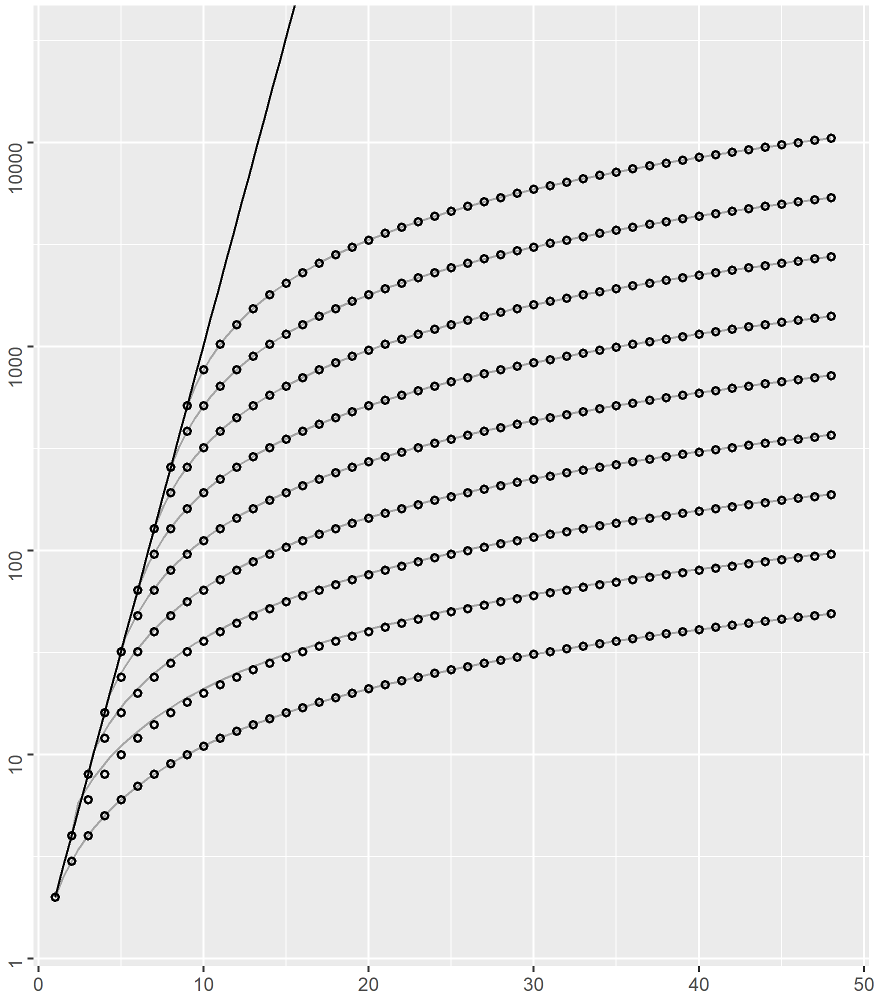
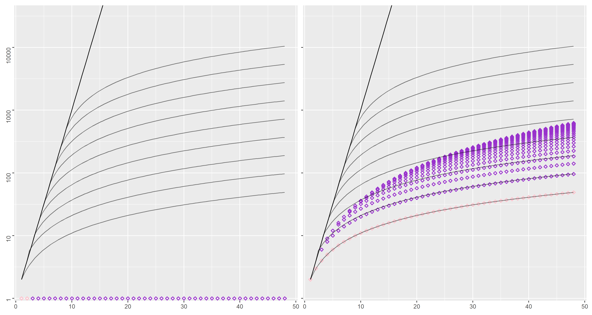
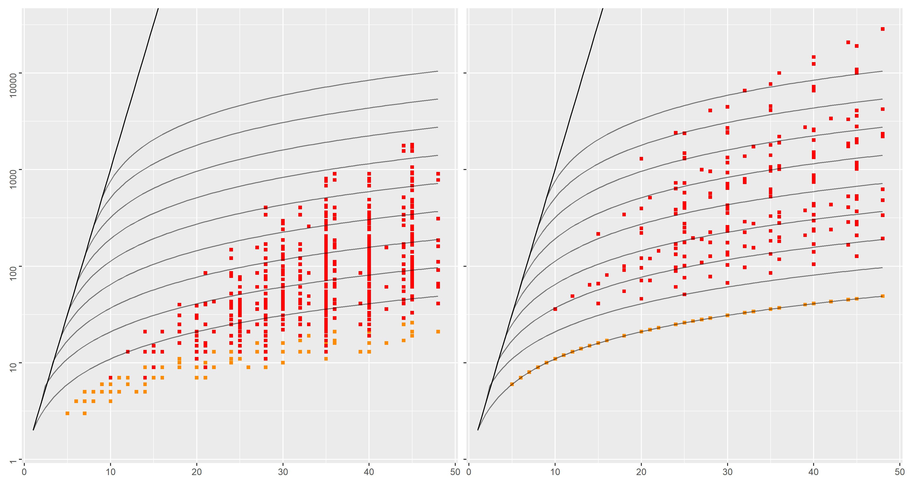
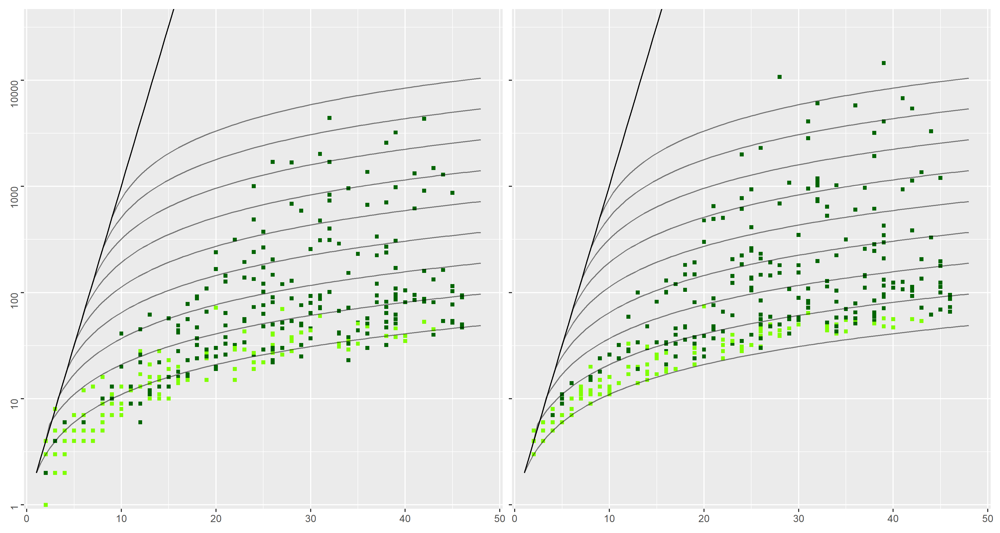
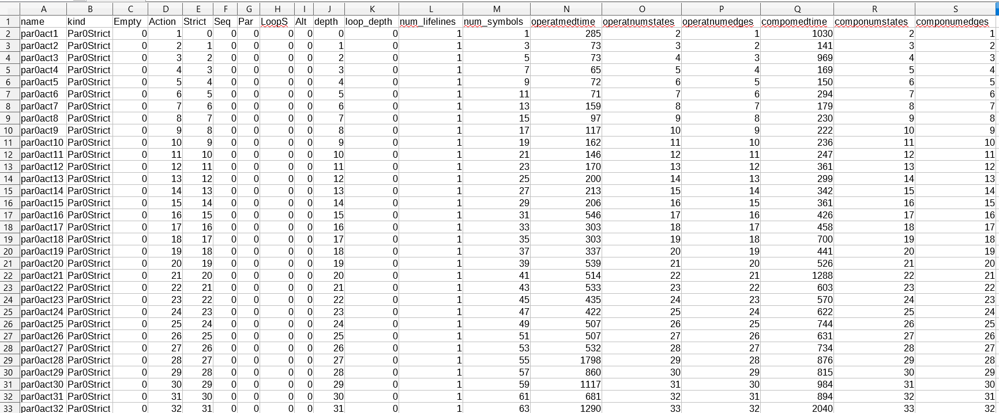
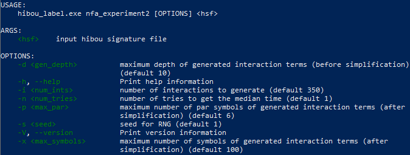

# A small benchmark for the automated synthesis of NFA from interaction diagrams using HIBOU


Interactions encode as binary tree terms behavioral models similar to Message Sequence Charts and UML Sequence Diagrams.
For a formal semantics of interactions, see [this paper](https://link.springer.com/chapter/10.1007/978-3-031-10363-6_8).

[HIBOU](https://github.com/erwanM974/hibou_label) implements various features to manipulate interactions.

In this repository, we benchmark and compare two distinct methods for generating Non-deterministic Finite Automata from interactions.
See also [this paper](https://arxiv.org/abs/2306.02983).

An incremental approach roughly consists in using a Structural Operational Semantics (SOS) of interactions to execute it (one atomic action at a time).
From the Control Flow Graph thus explored, we build a NFA which set of states correspond to the set of derivative interactions that can be reached 
(via the successive execution of actions) from the initial.
Term rewriting is further utilized to merge semantically equivalent derivatives so as to reduce this number of states on the fly.

A compositional approach roughly consists in mapping interaction operators to classical NFA operators (e.g. strict sequencing to concatenation, loops to kleene star etc.)
and building a NFA recursively from the leaves of the interaction term to its root.
A strong limitation of this approach is that there are no equivalent NFA operators for some interaction operators 
(in particular weak sequencing and all the operators that are related to it (e.g., concurrent regions, weakly sequential loops etc.)).
Thus this method can only be applied on a subset of interactions which satisfy specific constraints.


In order to compare these two methods, we thus restrict ourselves to a certain subset of interactions which are bounded
(i.e. no process divergence) 
and local-choice 
(i.e. approximating weak sequencing as strict sequencing outside basic sub-interactions has no effect on the trace language).


What we compare concerns the size (in number of states) of the NFA synthesized using both methods.


## A common grid for representing experimental results

In order to set a scale and thus improve the understanding of the size of generated NFA against that of the corresponding input interactions,
we use the common grid represented below.



The $x$ axis corresponds to the number of actions in an input interaction
(i.e., measure $|i|$ of interaction $i$) and the $y$ axis to the number of states in a generated NFA. 
Let us remark that the $y$ axis is in logarithmic scale.

The straight black line on the left corresponds to the function $x \mapsto 2^x$, 
thus giving the upper bound $2^{|i|}$ on the cardinal of the set $reach(i)$ of all the interactions reachable from $i$ by successively executing atomic actions.

The $432$ points on the diagram each correspond to an interaction of the form: $par(a_1,\cdots,par(a_k,strict(a_{k+1},\cdots,strict(a_{n-1},a_n)\cdots))\cdots)$,
for any set of $1 \leq n$ distinct actions $a_1$ through $a_n$, and any $k \in [0,n-1]$. 
If $k=0$, it consists of the strict sequencing of the $n$ actions, which yields a minimal NFA of $n+1$ states. 
If $k=n$, it corresponds to the parallel composition of the $n$ actions, which yields a minimal NFA of size $2^n$.
The dataset is built by varying $n$ from $1$ to $48$ and $k$ from $0$ to $8$ (hence, $432$ interactions with some overlap).

On the diagram, the position of each of the $432$ points corresponds to $|i|$ on the $x$ axis and the number of states of the minimal NFA associated 
to the trace language of $i$ on the $y$ axis.

With these simple interactions, both approaches to generating NFA (incremental and compositional) trivially return the minimal NFA.
Indeed, for $k=0$ the NFA has the form of a line, expressing successively actions $a_1$ to $a_n$. 
The incremental approach obtains this by successively executing the actions while a compositional approach might assimilate the initial and final states of 
each $2$ states NFA corresponding to executing a single action. 
For $k > 0$, because all actions are distinct, the interleaving are all explored by the incremental approach while the compositional 
obtains the same result via successive products of states.

We remark that, depending of the value of $k$ between $0$ and $8$, the datapoints form curves.
We approximate these curves using functions $x \mapsto 2^k*(x-k)+1$ (which coincides with $x \mapsto x+1$ for $k=0$).
These curves serve as a common grid to appreciate and compare both approaches w.r.t. each other and w.r.t. the size of minimal NFAs obtained from interactions with the same number of actions (i.e., at $|i|$ fixed).


## How to read the diagrams

We will use the grid to compare both approaches on 3 datasets. 
For each dataset, we will present two diagrams:
- the diagram on the left plots the results of using the incremental method on the dataset
- the diagram on the right plots the results of using the compositional method on the dataset
 
As both diagrams have the same referential and grid, it is easy to compare the approaches by comparing the $y$ position of datapoints 
(the higher they are, the more states the corresponding NFAs have). 
Let us also keep in mind the logarithmic scale on the $y$ axis.

Because the $par$ operator has an important effect on the minimal number of states,
we will also color interactions without $par$ operators using a lighter color:
- pink instead of purple for the first dataset
- orange instead of red for the second
- with a lighter shade of green for the third


## First dataset




We consider a first dataset (named "loop-alt") with interactions of the form
$par(loop_S(alt(a_1,\cdots,a_k)),loop_S(alt(a_{k+1},\dots,a_n)))$, with $n \in [1,48]$ and $k\in [0,n/2]$.

Using the incremental approach, whichever are the numbers $n$ and $k$,
we always have a NFA with a single state and $n$ self transitions. 


This is not the case for the compositional approach, 
in which the number of states grows rapidly with the number of actions and the degree of parallelization 
(up to $625$ states for $48$ actions).


## Second dataset


We now consider a `locks' dataset, which adapts a well-known regular expression example into digital lock use cases. 
See also [this repository](https://github.com/erwanM974/hibou_nfa_generation) for further details.


A digital lock is represented by an interaction
$strict(loop_S(alt(r_1,\cdots,r_n)),r_1^c,alt(r_1,\cdots,r_n)^{c'})$
 where $r_1$ through $r_d$ are $d$ reception actions on the same lifeline for different possible digits in an alphabet.
 
In order to open the lock, a correct sequence of $c$ digits must be entered ($r_1^c$ in the example)
followed by $c'$ other digits ($alt(r_1,\cdots,r_d)^{c'}$ in the example). 

Several such locks may then be composed either strictly sequentially, or in parallel. 

The dataset is built by varying the number of locks, how these locks are related (via $strict$ or $par$) and, for each lock, which are the values of $d$, $c$ and $c'$.





Minimal DFA associated to such interactions have exponentially more states than their NFA counterpart. 
Experimental results show that the incremental approach limits this state space explosion, which is less visible for the compositional approach.


## Third dataset





The diagram above summarizes results on a "random" dataset, containing randomly generated interactions. 
This roughly consists in drawing symbols (i.e. symbols of the interaction language) recursively until an interaction term is built. 
Special cases are made to ensure finite depth and that we have $seq$ only within basic interactions 
(so as to conform to the limitations of the compositional approach). 

We considered $350$ randomly generated interactions with less than $50$ actions and less than $6$ $par$ symbols. 

While the first two datasets ("loop-alt" and "locks") contain interactions with specific structures that could advantage 
the incremental approach, the "random" dataset does not. 
Still, experimental results shows that the incremental method consistently outputs smaller NFAs than the compositional approach.


## The raw experimental data

The raw data used to plot the diagrams above is given in the "precomputed_data.csv" file.

A partial screenshot of this raw data is given below.




Each row corresponds to an interaction / a datapoint in the above diagrams.

Each column corresponds to an attribute associated to the datapoint (there are much more attributes than the ones used to plot the diagrams).

The *kind* column specifies to which dataset the interaction belongs:
- all the *ParXStrict* interactions belong to the unnamed dataset used to draw the common grid
- all the *LoopAlt* and *LoopAltNoPar* interactions belong to the "loop-alt" dataset
- all the *Doors* and *DoorsNoPar* interactions belong to the "locks" dataset
- all the *Random* and *RandomNoPar* interactions belong to the "random" dataset


The *Action* column gives the number of atomic actions contained in the syntactic structure of the interaction.
It gives the $x$ position of the datapoints on the diagrams.

The *operatnumstates* column gives the number of states of the NFA synthesized using the incremental/operational method.
It is used for the $y$ position of the datapoints on the left-hand-side diagrams.

The *componumstates* column gives the number of states of the NFA synthesized using the compositional method.
It is used for the $y$ position of the datapoints on the right-hand-side diagrams.

### How to redraw the diagrams from the raw data

In order to redraw the diagrams, you can use the R script in "nfagen_plot.r" as follows:
```
Rscript nfagen_plot.r
```
or, on windows / Powershell :
```
Rscript.exe .\nfagen_plot.r
```


## How to reproduce the experiments / regenerate the data

With the HIBOU tool executable in the repository you can use the `nfa_experiment2` command to regenerate the data.

You can access the help of the command as follows:

```
./hibou_label.exe nfa_experiment2 -h
```

Which outputs the following, which explains what are the available options etc.:



The input hibou signature file is used to define the signature of the randomly generated interactions (for the "random" dataset).
In the experiments presented above, the signature in the file "signature.hsf" has been used.

Hence, in order to reproduce the experimental data from the file "precomputed_data.csv", you may simply type:
```
./hibou_label.exe nfa_experiment2 .\signature.hsf
```
It is possible that you do not get the same randomly generated interactions due to platform specific issues with RNG.
Still, on a fixed platform, setting the seed should enforce the generation of the same "random" dataset each time.

After running the command, a file "signature_exp.csv" or any "X_exp.csv" file depending on the name of the "X.hsf" signature file will be generated.
This ".csv" file can then be used as input for the R script via modifying it on line 214.

